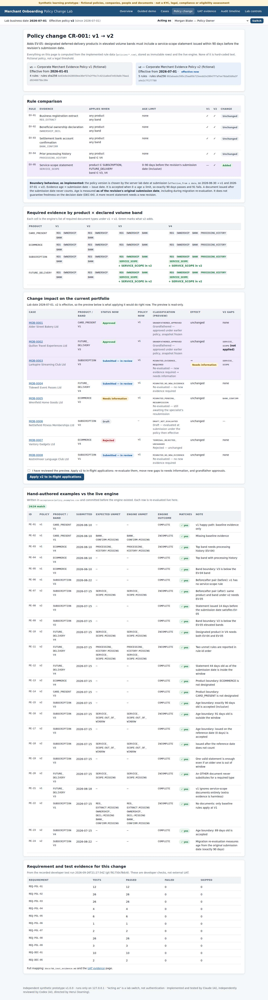

# Merchant Onboarding Policy Change Lab — Business Analyst & UAT Case Study

> **Recruiters and non-technical readers:** start with the plain-English **[HR overview](docs/HR_OVERVIEW.md)**.
> It covers the problem, a normal and a failure example, the 3-minute demo, screenshots, evidence, limits and who did what.

An independent, **synthetic** workflow prototype for corporate merchant onboarding at a fictional payment
provider. It shows one coherent business change end to end: an effective-dated evidence policy moves from
**v1 to v2 on 2026-07-01**. Approved cases are grandfathered, in-flight cases follow an explicit migration
rule, and stale reviewer actions are refused. Everything is backed by requirements, acceptance scenarios written
before the code, and recorded test evidence.

> **Truthful scope.** The policies, companies, people, identifiers (`SYN-…`) and documents are invented.
> This is not a KYC, AML, legal, compliance or merchant-eligibility assessment. Only document **metadata** is
> stored. The business context and assumptions were **authored**, not gathered in stakeholder interviews. The
> acceptance evidence is **developer acceptance checks**: **external UAT has not been performed** and there is no signoff.
> "Acting as" a synthetic actor is a lab switch, **not authentication**.
>
> **Who did what.** Claude (AI) designed, implemented and tested the code, wrote the documents and captured the
> screenshots. Codex (AI) reviewed it independently and found real defects (`docs/defect_log.md`). Herui
> directs the project and is learning BA/UAT practice through it.



## The business problem

Merchants that take payment now and deliver later (subscriptions, pre-paid tours and event passes) create
refund exposure. Change request **CR-001** adds rule **EV-05**: from 2026-07-01, SUBSCRIPTION or FUTURE_DELIVERY
applications in declared volume bands V3/V4 must include a *service-scope statement* issued 0–90 days before the
revision's submission date. The hard part is not the rule. It is changing it **while cases are in flight**
without losing the audit trail or deciding on stale information.

| Situation on/after 2026-07-01 | What the prototype does |
|---|---|
| Case approved under v1 | Grandfathered. The frozen v1 snapshot is unchanged, and its v2 gap is shown as "not applied". |
| Case submitted under v1, still in review | Decisions are refused (`POLICY_MIGRATION_REQUIRED`) until the policy owner applies v2. It is then re-evaluated, and a **new** gap moves it to *needs information*. |
| A reviewer's page opened before a resubmission or migration | The approval is refused as `STALE_REVISION` / `STALE_POLICY_EVALUATION`, and nothing is written. |
| Double-click or retry | Same request key replays the original result. A conflicting reuse gets 409. |
| A reviewer who created or submitted the case | `SELF_REVIEW_FORBIDDEN` |

## Run it (offline, no credentials)

While this work is on its review branch, clone that branch exactly. After it is merged into `main`, drop the
`--branch …` part:

```bash
git clone --branch claude/dazzling-mendel-1zti2z https://github.com/herui03/merchant-onboarding-change-lab.git
cd merchant-onboarding-change-lab
python3 -m venv .venv                                  # Python 3.11+
.venv/bin/python -m pip install -r requirements.txt    # Flask only
./launch_demo.command                                  # macOS: you can also double-click it
```

Open **http://127.0.0.1:5058/**. The lab binds to 127.0.0.1 only. Other portfolio apps use 5057 and 5059.

| Command | What it does |
|---|---|
| `./launch_demo.command` | Checks Python/Flask (it **never installs** anything and prints exact commands if something is missing), keeps an existing `instance/merchant_onboarding_lab.db`, seeds only if it is missing, then starts. |
| `./launch_demo.command --reset` | **Stop the running server first** (Ctrl+C). It backs up the database to `instance/backups/`, reseeds and starts. It refuses and changes nothing if port 5058 is busy or a server holds the database. |
| `./launch_demo.command --check-only` | Runs the checks and database preparation without starting the server. |
| Terminal fallback | `.venv/bin/python -m moblab run --db instance/merchant_onboarding_lab.db` |

State persists across restarts. The runtime database, secret key and backups live in `instance/`, which is git-ignored.

## Demo

- **In the app:** the *Guided demo* page walks the before/after story and ticks steps off from the database.
- **Three-minute script:** [`docs/08_demo_script.md`](docs/08_demo_script.md). It uses one browser window, plus an optional stale-tab exercise with a private window.
- **No install possible?** Open [`replay/case_study_replay.html`](replay/case_study_replay.html) offline. It is a **recorded replay** of a developer Chromium run, not the live workflow.

## Evidence

```bash
.venv/bin/python -m pip install -r requirements-dev.txt        # pytest + Playwright
.venv/bin/python -m playwright install chromium                # browser for the E2E tests
.venv/bin/python -m pytest -q tests                             # service, HTTP, launcher and Chromium tests
```

- [`docs/06_test_evidence.md`](docs/06_test_evidence.md): generated from the recorded run. It gives counts, requirement → test and scenario → test maps, the browser story and layout measurements.
- [`docs/defect_log.md`](docs/defect_log.md): real defects, each reproduced before it was fixed, with regression tests.
- [`acceptance/`](acceptance/): hand-authored expected outcomes (24 policy examples, 10 date examples, 25 scenarios), committed in `a20b34b` **before** the engine and workflow code.
- CI: `.github/workflows/ci.yml` runs the tests on push/PR with a read-only token.

## Documents

| Document | Content |
|---|---|
| [HR overview](docs/HR_OVERVIEW.md) | Plain-English summary for recruiters: problem, normal and failure flow, demo, screenshots, evidence, limits |
| [00 Scope and truthfulness](docs/00_scope_and_truthfulness.md) | What is and isn't claimed, attribution, business-date authority |
| [01 Business context](docs/01_business_context.md) | Fictional As-Is / To-Be, pain points, actors, scope |
| [02 Requirements](docs/02_requirements.md) | Stable REQ IDs with observable acceptance criteria |
| [03 Assumptions and decisions](docs/03_assumptions_decisions.md) | Authored assumptions, decision log DEC-01…12, open questions |
| [04 Data and API contract](docs/04_data_api_contract.md) | Controls, input limits, endpoints, error codes, role matrix, data model |
| [05 Change request CR-001](docs/05_change_request_CR-001.md) | Rule, boundaries, transition rules, portfolio impact, impact matrix |
| [06 Test evidence](docs/06_test_evidence.md) | Generated from the recorded run |
| [07 Release recommendation](docs/07_release_recommendation.md) | Evidence-based recommendation; external signoff not performed |
| [08 Demo script](docs/08_demo_script.md) | Three-minute walkthrough |
| [09 CV templates](docs/09_cv_templates.md) | Conditional, honest wording |
| [学习与面试指南 (Chinese)](docs/zh/learning_guide_zh.md) | Concepts, demo script, 15 challenging Q&As, glossary |
| [Defect log](docs/defect_log.md) | Product, test-harness and documentation defects |

## Limits

- It is a synthetic prototype on the Flask development server, local only. It is not deployed and has no enterprise authentication.
- The policy thresholds are fictional. Evidence age is measured as of the submission date (DEC-04), not the decision date.
- Self-review covers "created or submitted" only (DEC-12).
- The run lock that protects `reset` uses POSIX `flock` (macOS/Linux). Windows is not a supported host.
- External UAT, stakeholder validation and business signoff have **not** happened.

## Layout

```
moblab/            engine, schema, service, queries, web (Flask + Jinja), CLI, evidence/replay builders
policies/          v1.toml, v2.toml — fictional rule data
acceptance/        expected outcomes written before implementation
tests/             service, HTTP, launcher, concurrency and Chromium (tests/e2e) checks
docs/              BA documents, generated evidence, screenshots, Chinese guide
evidence/          recorded run outputs (JSON)
replay/            offline recorded replay (HTML)
launch_demo.command
```
