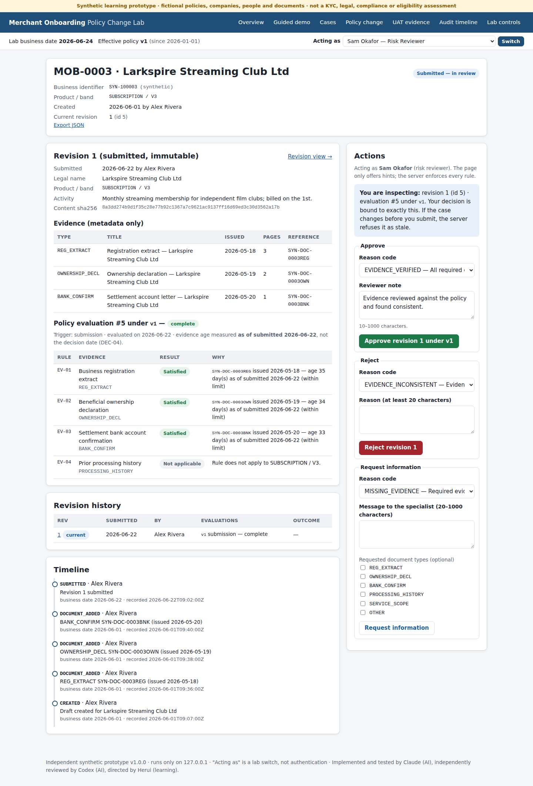

# Merchant Onboarding Policy Change Lab

A local web app for reviewing new business customers ("merchants") at a fictional payment provider. It shows
how a change to the evidence rules is rolled out while applications are already in review. When policy v2 takes
effect on 2026-07-01, the app re-checks cases in progress and sends back the ones that now lack a required document.
It leaves earlier approvals unchanged and refuses approvals made from out-of-date screens. It is a Business Analyst /
UAT case study with requirements, acceptance scenarios, a change request and automated tests. All data is synthetic.

**Quick links:** [Non-technical overview](docs/HR_OVERVIEW.md) · [3-minute demo script](docs/08_demo_script.md) ·
[Screenshots](docs/screenshots/) · [Recorded replay (offline HTML)](replay/case_study_replay.html) ·
[Test evidence](docs/06_test_evidence.md)



## What it does

- **Application workflow.** An application goes from draft to submitted. It can be sent back for more information and
  resubmitted, and it ends approved or rejected. Information requests, decisions, resubmissions and reopenings each need a
  written reason. Every submission is stored as a numbered, read-only revision. Rejected cases can be reopened, and
  approvals are final.
- **Versioned rules with effective dates.** Policies v1 and v2 are data files. Each revision is checked against the version in
  force on its submission date. A comparison page shows the rule differences and a product × volume-band
  requirement matrix, both computed from the rule data.
- **Rule change for cases in progress.** A read-only impact preview classifies every case. The policy owner applies v2
  in one recorded step. Cases approved under v1 keep their original decision ("grandfathered"). Cases in review
  that have a new gap go back to the specialist with a system reason.
- **Decision checks.** Every approval or rejection is tied to an exact revision, rule version and evaluation. The server
  refuses decisions made from an out-of-date page (`STALE_REVISION`), decisions made before v2 is applied (`POLICY_MIGRATION_REQUIRED`),
  self-review, wrong-role actions, and a reused request key with different content. A refused action writes nothing. A
  repeated identical request returns the original result.
- **Audit trail.** Every change adds a timeline event. SQLite triggers block edits to past revisions, evaluations,
  decisions and events.
- **Local and self-contained.** It runs on `127.0.0.1:5058`. A launcher seeds a synthetic dataset, keeps state across
  restarts and backs up before a reset. Cases can be exported as CSV or JSON.

## Example: one application through the rule change

1. **22 June:** a specialist submits *MOB-0003 Larkspire Streaming Club Ltd* (a subscription business, volume band V3).
   Revision 1 is checked under v1 and is complete.
2. **24 June:** reviewer Sam opens revision 1 and leaves the page open.
3. **1 July:** v2 takes effect. Any approval of MOB-0003 is refused with `POLICY_MIGRATION_REQUIRED` until the policy owner applies v2.
4. The policy owner previews the impact and applies v2. MOB-0003 moves to *needs information* because it has a new gap: a
   service-scope statement. MOB-0002, approved under v1 in June, stays approved.
5. The specialist adds a service-scope statement issued on 28 June and resubmits. Revision 2 is checked under v2 and is complete.
6. Sam clicks *Approve* on the page opened on 24 June. It is refused with `STALE_REVISION`, and nothing is saved. After
   reloading, Sam approves revision 2 under v2.

## Screenshots and demo

| Screen | Link |
|---|---|
| Revision 1 reviewed under v1 | [04](docs/screenshots/04-mob0003-inspected-under-v1-desktop.jpg) |
| Approval blocked until v2 is applied | [05](docs/screenshots/05-approval-blocked-migration-required-desktop.jpg) |
| Rule comparison and impact preview | [06](docs/screenshots/06-policy-comparison-and-preview-desktop.jpg) |
| Case sent back for the missing document | [08](docs/screenshots/08-needs-information-after-migration-desktop.jpg) |
| Out-of-date approval refused | [10](docs/screenshots/10-stale-approval-refused-desktop.jpg) |
| Revision 2 approved under v2 | [11](docs/screenshots/11-approved-under-v2-desktop.jpg) |
| Earlier approval unchanged (grandfathered) | [12](docs/screenshots/12-grandfathered-v1-approval-desktop.jpg) |
| Phone-width layout | [09](docs/screenshots/09-resubmitted-revision-2-under-v2-narrow.jpg) |

- **Guided demo:** the *Guided demo* page in the app walks through the example and ticks off steps as they happen.
- **Demo script:** [`docs/08_demo_script.md`](docs/08_demo_script.md) gives the three-minute walkthrough in a single browser window,
  plus an optional stale-page exercise that uses a private window.
- **Without installing:** download [`replay/case_study_replay.html`](replay/case_study_replay.html) and open it in a browser.
  It is a recording of an automated Chromium run, not the live app.

## Run it locally

You need Python 3.11+ and macOS or Linux with bash.

```bash
git clone https://github.com/herui03/merchant-onboarding-change-lab.git
cd merchant-onboarding-change-lab
python3 -m venv .venv
.venv/bin/python -m pip install -r requirements.txt    # Flask
./launch_demo.command                                  # on macOS it can also be double-clicked
```

Open **http://127.0.0.1:5058/**. The port is fixed, and the launcher stops if it is already in use.

| Command | What it does |
|---|---|
| `./launch_demo.command` | Checks Python and Flask, and prints the exact setup commands if something is missing (it installs nothing). It keeps an existing `instance/merchant_onboarding_lab.db`, seeds one only if missing, then starts. |
| `./launch_demo.command --reset` | Stop the running server first (Ctrl+C). Backs up the database to `instance/backups/`, reseeds and starts. Refuses without changing anything if port 5058 is busy or a server holds the database. |
| `./launch_demo.command --check-only` | Runs the checks and database preparation without starting the server. |
| Terminal fallback | `.venv/bin/python -m moblab run --db instance/merchant_onboarding_lab.db` |

The database, session key and backups live in `instance/`, which git ignores.

## Built with

Python 3.11+, Flask with Jinja templates, and SQLite. The pages are plain HTML and CSS with no JavaScript framework. Tests use pytest and
Playwright (Chromium). GitHub Actions runs CI with a read-only token.

## Tests and documentation

```bash
.venv/bin/python -m pip install -r requirements-dev.txt     # pytest + Playwright
.venv/bin/python -m playwright install chromium             # browser for the end-to-end tests
.venv/bin/python -m pytest -q tests
```

- **Recorded run.** On code commit `6a6be96` the recorded run gave 117 passed, 0 failed and 0 skipped. It covers service, HTTP, launcher,
  concurrency and Chromium browser checks at 1440 px and 390 px. See [`docs/06_test_evidence.md`](docs/06_test_evidence.md).
- **Expected outcomes first.** [`acceptance/`](acceptance/) holds 24 rule examples, 10 date examples and 25 acceptance scenarios.
  They were committed in `a20b34b`, before the rules engine and workflow code.
- **Defect log.** [`docs/defect_log.md`](docs/defect_log.md) lists six product defects found during development. Each was reproduced,
  fixed and covered by a regression test. Test-harness and documentation defects are listed separately.
- **CI.** [`.github/workflows/ci.yml`](.github/workflows/ci.yml) runs on pushes to `main` and `claude/**` branches and on pull requests.
- **Delivery branch.** The original delivery branch contains the recorded run and has been merged into `main`. It can still be
  cloned: `git clone --branch claude/dazzling-mendel-1zti2z https://github.com/herui03/merchant-onboarding-change-lab.git`

| Document | Content |
|---|---|
| [Non-technical overview](docs/HR_OVERVIEW.md) | Plain-English summary with the same example |
| [00 Scope](docs/00_scope_and_truthfulness.md) | What the project covers and excludes; how the simulated business date works |
| [01 Business context](docs/01_business_context.md) | Fictional As-Is / To-Be process, pain points, actors |
| [02 Requirements](docs/02_requirements.md) | Requirement IDs with observable acceptance criteria |
| [03 Assumptions and decisions](docs/03_assumptions_decisions.md) | Assumptions, decision log DEC-01…12, open questions |
| [04 Data and API contract](docs/04_data_api_contract.md) | Input limits, endpoints, error codes, role matrix, data model |
| [05 Change request CR-001](docs/05_change_request_CR-001.md) | Rule, boundaries, transition rules, portfolio impact, impact matrix |
| [06 Test evidence](docs/06_test_evidence.md) | Generated from the recorded run |
| [07 Release recommendation](docs/07_release_recommendation.md) | Recommendation and conditions before release |
| [08 Demo script](docs/08_demo_script.md) | Three-minute walkthrough |
| [Chinese-language study guide](docs/zh/learning_guide_zh.md) | Concepts, walkthrough, Q&A, glossary |
| [Defect log](docs/defect_log.md) | Product, test-harness and documentation defects |

## Repository layout

```
moblab/            rules engine, schema, workflow service, queries, web app (Flask + Jinja), CLI, evidence/replay builders
policies/          v1.toml, v2.toml (fictional rule data)
acceptance/        expected outcomes written before implementation
tests/             service, HTTP, launcher, concurrency and Chromium (tests/e2e) checks
docs/              BA documents, generated evidence, screenshots, Chinese-language guide
evidence/          recorded run outputs (JSON)
replay/            offline recorded replay (HTML)
launch_demo.command
```

## Limits

- **Data.** The companies, people, identifiers (`SYN-…`) and documents are synthetic. Only document metadata is stored, never files.
- **Scope.** This is not a KYC, AML, legal, compliance or eligibility assessment. The 90-day window and the V3/V4 volume bands are
  fictional. The business context and assumptions were written for the case study, not gathered from stakeholder interviews.
- **Validation.** The checks are automated developer acceptance checks. External UAT has not been performed, and there is no business sign-off.
- **Runtime.** It runs locally only, on Flask's development server, and has not been deployed. "Acting as" is a demo switch, not authentication, and the business date is
  a simulated lab clock. The reset lock uses POSIX `flock`, so it supports macOS and Linux only.
- **Design limits.** Evidence age is measured at the submission date, not the decision date (DEC-04). Self-review blocks only the
  person who created or submitted a case (DEC-12).
