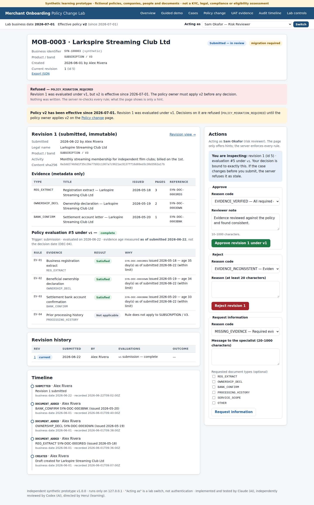

# Merchant Onboarding Policy Change Lab — overview

*A non-technical summary. Setup and technical detail are in the [README](../README.md).*

Payment providers check a new business customer's documents before letting it take card payments. This project is
a small web app that runs that review process and shows how a change to the checking rules is rolled out while
applications are still being reviewed. It is a Business Analyst and user-acceptance-testing (UAT) case study built on
synthetic data.

## What the app shows

- **A review process with a paper trail.** A specialist prepares an application and a reviewer decides it. Every submission is
  kept as a numbered version that cannot be edited afterwards, and every step is recorded in a timeline.
- **Rules with a start date.** The old rules (v1) apply until 30 June 2026. From 1 July, the new rules (v2) also require a
  "service-scope statement", issued within the 90 days before submission. The requirement applies to subscription businesses
  and to businesses paid in advance for things delivered later, if they are in the two highest volume bands.
- **A rule change in the middle of reviews.** Before the new rules are applied, the policy owner sees a preview of their effect on
  every case. Customers approved earlier keep their approval. Cases still in review that now miss the new document go back
  to the specialist with a clear reason.
- **Checks on every decision.** A decision is tied to the exact version the reviewer looked at. The app refuses decisions
  made from an out-of-date screen, people reviewing their own cases, and actions outside a person's role. A refused action
  saves nothing.
- **Business analysis documents.** These include a change request with impact analysis, requirements, acceptance scenarios and a
  decision log. See the [README](../README.md#tests-and-documentation) for the full list.

## Example: one application through the rule change

1. **22 June:** a subscription business, *Larkspire Streaming Club Ltd*, is submitted. Version 1 meets the old rules.
2. **24 June:** reviewer Sam opens version 1 and leaves the page open.
3. **1 July:** the new rules take effect. Approving Larkspire is refused until the policy owner applies them.
4. The policy owner reviews the preview and applies the new rules. Larkspire is sent back for the missing service-scope
   statement. An earlier customer, approved in June, stays approved.
5. The specialist adds the statement and resubmits. Version 2 meets the new rules.
6. Sam clicks *Approve* on the page opened on 24 June. The app refuses it because that page shows an old version, and nothing
   is saved. Sam reloads, reviews version 2 and approves it.

## See it

- **Demo:** a [three-minute demo script](08_demo_script.md) walks through this example in the running app.
- **Recording:** an offline [recorded replay](../replay/case_study_replay.html) shows the same steps. Download it and open it in a browser.
  It is a recording, not the live app.

| Step | Screenshot |
|---|---|
| Reviewer looks at version 1 under the old rules | [Open](screenshots/04-mob0003-inspected-under-v1-desktop.jpg) |
| Approval blocked until the new rules are applied | [Open](screenshots/05-approval-blocked-migration-required-desktop.jpg) |
| Old and new rules compared, with the effect on each case | [Open](screenshots/06-policy-comparison-and-preview-desktop.jpg) |
| New rules applied to cases in review | [Open](screenshots/07-v2-applied-desktop.jpg) |
| Case sent back for the missing document | [Open](screenshots/08-needs-information-after-migration-desktop.jpg) |
| Approval from an out-of-date page refused | [Open](screenshots/10-stale-approval-refused-desktop.jpg) |
| Version 2 approved | [Open](screenshots/11-approved-under-v2-desktop.jpg) |
| Earlier approval left unchanged | [Open](screenshots/12-grandfathered-v1-approval-desktop.jpg) |
| Phone-sized screen | [Open](screenshots/09-resubmitted-revision-2-under-v2-narrow.jpg) |

## Built with

- **Stack:** Python with the Flask web framework, a SQLite database file, and plain HTML/CSS pages.
- **Testing:** automated tests with pytest. Playwright drives a Chromium browser through the demo at desktop and phone widths.
- **CI:** GitHub Actions runs the tests automatically.
- **Setup:** it runs on a Mac or Linux computer with Python 3.11+. Install the requirements and run `./launch_demo.command`, then
  open `http://127.0.0.1:5058/`. The [README](../README.md#run-it-locally) has the exact commands.

## Testing

- **Expected results first.** The expected results were written before the app: 24 rule examples, 10 date examples and 25
  acceptance scenarios.
- **Recorded run.** In the recorded test run (code commit `6a6be96`), 117 automated checks passed, with 0 failed and 0 skipped.
  Details: [test evidence](06_test_evidence.md).
- **Defect log.** Six product defects found during development are listed in the [defect log](defect_log.md). Each was reproduced,
  fixed and covered by a new test.

## Limits

- **Data.** The company, customers, people and documents are invented. Only document details are stored, never files.
- **Scope.** This is not a real Know-Your-Customer, legal or compliance check. The rules and thresholds are made up. The business background
  was written for the case study, not gathered from interviews.
- **Validation.** The acceptance checks are automated developer tests. External UAT has not been performed and there is no business sign-off.
- **Use.** It runs on one computer only and has not been deployed or used by a business. "Acting as" a person is a demo switch,
  not a login, and the date is simulated for the demo.
